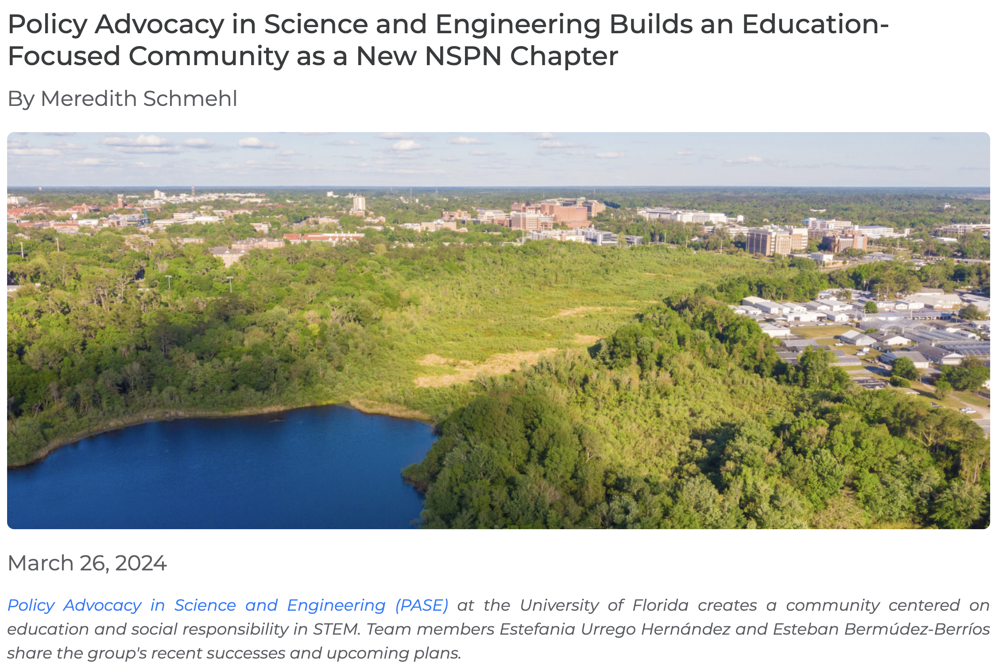

PASE is in the NSPN Chapter Spotlight!

<!--more-->

PASE Communications Committee members Estefania and Esteban shared PASE's mission and impact with NSPN in their latest blog post, which has been featured in this month's Chapter Spotlight.

Check out the blog here: https://scipolnetwork.org/nspn?recordId=recPmaQuTEJJ3rKal
