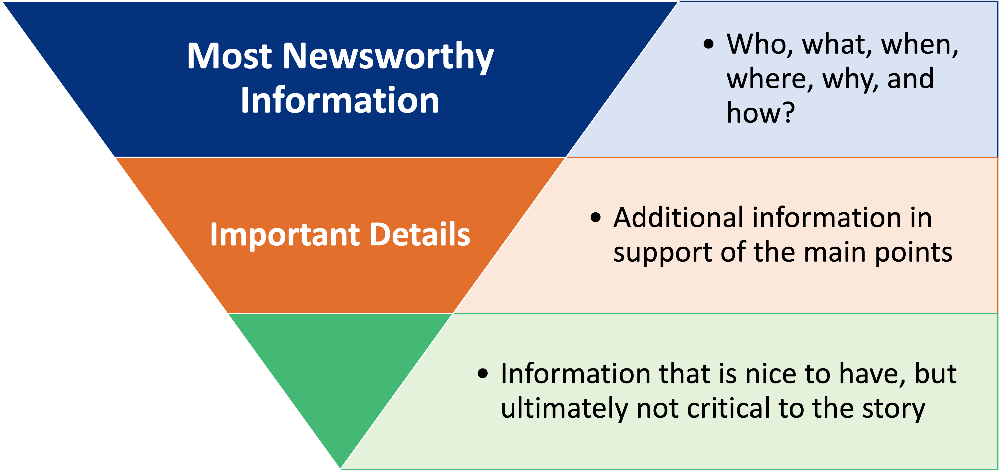

**First Things First: What is an Op-Ed?**
- Op-Ed stands for "opposite-editorial", since it is printed opposite the editorial column in a physical newspaper
- An op-ed is a column that represents a strong, informed, focused opinion of relevance to a targeted audience
  - In this case, op-eds will be focused on policy topics for a general audience

**Defining Characteristics of an Op-Ed**
- The main goal of op-ed writing is to persuade others to your point of view
  - Op-eds are typically 500 to 750 words long (800 words maximum)
  - Effective op-eds will:
    - Call attention to a relevant, though perhaps not immediately obvious, issue
    - Have a clearly defined point of view
    - Maintain a strong, unique voice throughout the piece
    - Be timely and topical

**Questions to Ask Yourself when Writing an Op-Ed**
- Do I have a clear point to make?
  - What is it?
- Who will care? 
  - Who are you trying to convince?
  - Who are you targeting? Why?
- Is there substance to my argument?
  - Can you offer first-hand experiences, expert knowledge, empirical evidence, etc.?

**Identifying Your Topic and Theme**
- Topic: Primary Focus of the column
  - First Paragraph
  - Issue + 5 W's (who, what, when, where, why)
- Theme: Overarching idea & importance
  - Can be found in the beginning or end
  - Serves as a turning point or transition into deeper aspects of your argument

**Maintaining a Strong Voice in Your Op-ed**
- A wide range of voice styles may be used:
  - Contemplative
  - Conversational
  - Descriptive or reportorial
  - Informative or observative
  - Humorous
  - Experienced or informed/informative
- Most Op-Ed pieces are conversational
  - Imagine yourself having a focused conversation with your reader

**Inverted Pyramid Structure**

- The inverted pyramid presents information in order of descending importance
- Organizing your op-ed in this way will help catch your readers' attention

**Crafting Your Opening Sentence**
- The first line of an op-ed is crucial
  - "Hook" -> Grab the reader's attention!
  - Lays the foundation for your argument (1 paragraph)
  - Examples: Strong claim, metaphor, surprising fact, etc.
- Be sure to address why your topic is relevant now & to your readers

**Researching Your Topic**
- Two methods of research for an Op-Ed:
  1. Primary or Field Research: 
    - Known expert knowledge or experiences
    - Examples: Interviews, Observations, etc.
  2. Secondary Research: 
    - Academic journals & peer-reviewed research
    - Examples: databases, research outcomes, current policies, etc

**Crafting Your Ending**
- Strong Op-Ed endings have the following requirements
  - Echoes or answers introduction
  - Last & most memorable detail
  - Calls the reader to action
  - Foreshadowed by preceding statements
- Two types of endings
  - Open endings – suggests a conclusion rather than stating
  - Closed endings – states a conclusion rather than suggests

**Op-ed Revision Checklist**
- Prior to submission for publication, be sure to check:
  - Clarity
  - Coherence and unity
  - Simplicity
  - Uniform voice, tone, & opinion
  - Accuracy of sources used (formal citations are not necessary)

**Tips for Successful Op-Ed Writing**
1. Do not write in first-person
2. Make sure each paragraph included contains only 1 main idea with support points
3. Use statistics, peer-reviewed studies, etc. To support your arguments
4. Always included at least one "con" argument to balance out your "pro" arguments

**Additional Resources**
- [Writing and Submitting an Opinion Piece](https://news.climate.columbia.edu/2020/05/04/writing-submitting-opinion-piece/)
- [How to Write an Op-Ed or Column](https://projects.iq.harvard.edu/files/hks-communications-program/files/new_seglin_how_to_write_an_oped_1_25_17_7.pdf)
- [How to Write an Op-Ed Article](https://www.umass.edu/pep/sites/default/files/how_to_write_an_oped-duke_2.pdf)
- [The Op-ed Project](https://www.theopedproject.org/resources)
- [Writing & Placing Opinion Pieces](https://www.ancor.org/writing-placing-opinion-pieces/)
- [And Now a Word From Op-Ed](https://www.nytimes.com/2004/02/01/opinion/and-now-a-word-from-op-ed.html)
