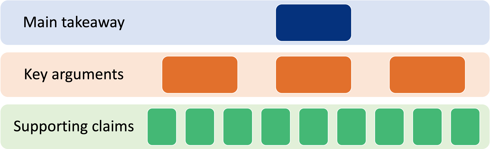

**Purpose of a Policy Poster**
- As experts in your field, you are well-suited for making policy recommendations to policymakers and/or policy advocates
  - One way to share your expertise is by making a poster
- A policy poster is a visual overview of your policy pitch / policy recommendations
  1. Start with your main takeaway
  2. Put impactful graphs and figures front and center
  3. Lay out the pros and cons of three policy options for a given issue
  4. Reiterate why your recommendation is the best option

**Making Reasonable Policy Recommendations**
- Recognize that we do not live in an ideal world - just because a policy option is great in theory does not mean it will be great in actuality
- Be sure to consider:
  - Practicality
  - Cost effectiveness
  - Social acceptability
  - Political feasibility
  - Enforcement / regulation
  - Potential impacts

**Questions to Guide Identification of Policy Options**
1. Has an appropriate set of options been identified to address a problem?
2. What benefits are important to those who will be affected, and which benefits are likely to be achieved with each option?
3. What harms are important to those who will be affected, and which harms are likely to arise with each option?
4. What are the local costs of each option and is there local evidence about their cost-effectiveness?
5. What adaptations might be made to any given option, and could they alter its benefits, harms and costs?
6. Which stakeholder views and experiences might influence an option's acceptability and its benefits, harms, and costs?

**Creating Content for your Policy Poster**
- Know your audience
  - What does your target care about / what motivates them?
- Be concise and specific
  - Put your bottom line up front
  - Their time and attention is limited – make every word count
  - Tell them exactly what you want them to do
- Write for a general audience
  - Eliminate jargon and research methods
  - Tell stories or use clear analogies to explain complex topics
- Know your pitch
  - Be able to give your recommendations without your poster

**Organizing your Policy Poster**

- Remember: your goal is to convince policymakers to implement your policy recommendations by demonstrating that your suggestions are actionable, evidence-based, and reasonable

**Policy Poster Templates**
- MIT Communications Lab recommends using the #evenbetterposter framework since it emphasizes efficient knowledge transfer
  - It may be uncomfortable to use this when coming from a research background, but it works!

 
**Additional Resources**
- [SUPPORT Tools for Evidence-informed Health Policymaking (STP)](https://health-policy-systems.biomedcentral.com/articles/supplements/volume-7-supplement-1)
- [MIT Communications Lab Introduction to Public Policy Communication](https://mitcommlab.mit.edu/be/commkit/public-policy-communication-introduction/)
- [MIT Communications Lab article on the #evenbetterposter framework](https://mitcommlab.mit.edu/be/2023/09/27/toward-an-evenbetterposter-improving-the-betterposter-template/)
- [MIT Poster Templates](https://mit-becl.github.io/Poster_Resources/)
- [MIT Policy Lab](https://policylab.mit.edu/)
- [Harvard Kennedy School of Government Communications Program Advocacy Resources](https://www.hks.harvard.edu/more/about/leadership-administration/academic-deans-office/communications-program/consulting)

